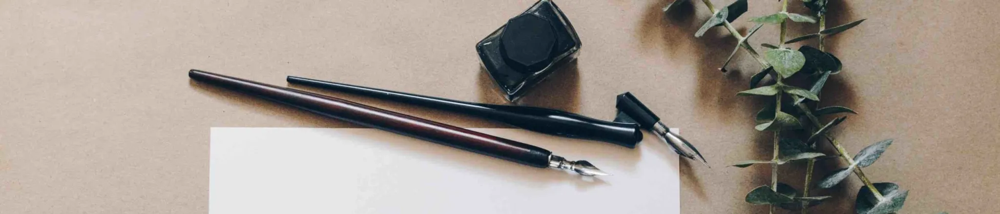

  

# <h1 align="center">ReStranger</h1>

## About me
I'm a beginner programmer learning python, lua and rust. In my free time, I customize and design the system. Here you will find my projects and dotfiles

#### About my system:

#### Languages:

#### Technologies and skills:

#### Social and Contacts:

